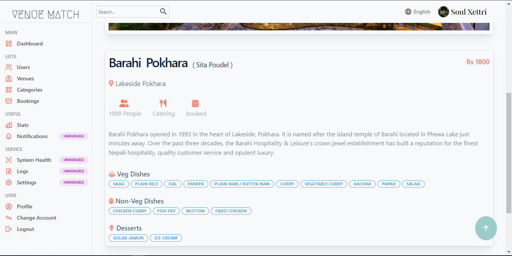

# Venue-Match

<p align="center">
  Welcome to Venue-Match, a comprehensive platform built with React, Vite, TypeScript, CSS, SCSS, and simplePhp, dedicated to facilitating venue bookings for special occasions like birthdays, weddings, and more in Nepal. The project encompasses a user-friendly front-end, a straightforward back-end using simplePhp, a mobile app powered by Flutter, and seamless payment integration through Khalti. Additionally, Venue-Match features an admin panel for user management and statistical insights, ensuring a smooth experience for both users and administrators.</em>
</p>

## Technologies Used

### Front-end
- [React](https://reactjs.org/)
- [Vite](https://vitejs.dev/)
- [TypeScript](https://www.typescriptlang.org/)
- CSS
- SCSS
- [Material-UI Icons](https://mui.com/components/material-icons/)
- [Mantine UI Library](https://mantine.dev/)
- [Tabler Icons](https://tablericons.com/)
- [Tailwind CSS](https://tailwindcss.com/)
- [Styled Components](https://styled-components.com/)
- [Emotion](https://emotion.sh/)
- [Recharts](https://recharts.org/en/)

### Back-end
- simplePhp

### Mobile App
- [Flutter](https://www.fulter.net/en/home/)

### Payment Integration
- [Khalti](https://www.khalti.com/)

### Package Manager
- [Yarn](https://yarnpkg.com/)

## Getting Started

To run Venue-Match locally, follow these steps:

1. **Clone the repository:**
    ```bash
    git clone https://github.com/soul-xettri/venuematch.git
    ```

2. **Navigate to the project directory:**
    ```bash
    cd venuematch
    ```

3. **Install dependencies:**
    ```bash
    yarn install
    ```

4. **Run the development server:**
    ```bash
    yarn dev
    ```

5. **Open your browser and visit [http://localhost:5173](http://localhost:5173) to explore Venue-Match.**

### Axios Error

Note: If you encounter an axios error during local development, it might be due to the removal of API routes from this public repository. To resolve this issue, please ensure that you have access to the necessary backend APIs or contact the project maintainers for the required API configuration.

## Available Scripts

- **`yarn dev`**: Start the development server.
- **`yarn build`**: Build the production-ready application.
- **`yarn lint`**: Lint the TypeScript code using ESLint.
- **`yarn preview`**: Preview the production build locally.

## Dependencies

Check the `package.json` file for a complete list of dependencies and devDependencies.


## Screenshots

### 1) HomePage

<p align="center">
  
  <br />
  <em>Navbar Component</em>
</p>

<p align="center">
  
  
  <br />
  <em>Hero Section with Animation</em>
</p>

<p align="center">
  
  <br />
  <em>Detail Section</em>
</p>

<p align="center">
  
  <br />
  <em>Video Section</em>
</p>

<p align="center">
  
  <br />
  <em>Category Section</em>
</p>

<p align="center">
  
  
  <br />
  <em>Popular Section</em>
</p>

<p align="center">
  
  <br />
  <em>Info Section</em>
</p>

<p align="center">
  
  <br />
  <em>Reservation Section</em>
</p>

<p align="center">
  
  
  <br />
  <em>Feed Section</em>
</p>

<p align="center">
  
  <br />
  <em>Footer Component</em>
</p>

### 2) VenuePage

<p align="center">
  
  
  <br />
  <em>Venue Lists wih different Categories</em>
</p>

<p align="center">
  
  
  <br />
  <em>Venue Details</em>
</p>

### 3) AboutPage

<p align="center">
  
  <br />
  <em>About Hero Section</em>
</p>

<p align="center">
  
  <br />
  <em>Who We ARE</em>
</p>

### 4) GalleryPage

<p align="center">
  
  <br />
  <em>Gallery Hero Section</em>
</p>

<p align="center">
  
  
  <br />
  <em>Galleries</em>
</p>

### 5) AuthPage

<p align="center">
  
  <br />
  <em>Signin Section</em>
</p>

<p align="center">
  
  
  <br />
  <em>Signup Section</em>
</p>

### 5) Admin Dashbord

#### i) Dashbord

<p align="center">
  
  
  <br />
  <em>Dashbord</em>
</p>

#### ii) Users

<p align="center">
  
  <br />
  <em>User Table</em>
</p>

<p align="center">
  
  <br />
  <em>Add New User</em>
</p>

<p align="center">
  
  
  <br />
  <em>User Detail</em>
</p>

<p align="center">
  
  <br />
  <em>User Edit</em>
</p>

#### iii) Venues

<p align="center">
  
  <br />
  <em>Venue Table</em>
</p>

<p align="center">
  
  
  <br />
  <em>Add New Venue</em>
</p>

<p align="center">
  
  
  
  <br />
  <em>View Venue</em>
</p>

<p align="center">
  
  
  <br />
  <em>Update Venue</em>
</p>

<p align="center">
  
  <br />
  <em>Add New Dish</em>
</p>

#### iv) Categories

<p align="center">
  
  <br />
  <em>Category Table</em>
</p>

<p align="center">
  
  
  <br />
  <em>Add Category</em>
</p>

#### v) Bookings

<p align="center">
  
  <br />
  <em>Current Booking Table</em>
</p>

<p align="center">
  
  <br />
  <em>View Booking Details</em>
</p>

#### vi) Stats

<p align="center">
  
  <br />
  <em>Venue Match Stats</em>
</p>

## License

This project is licensed under the MIT License.

Happy event planning with Venue-Match! 🎉
